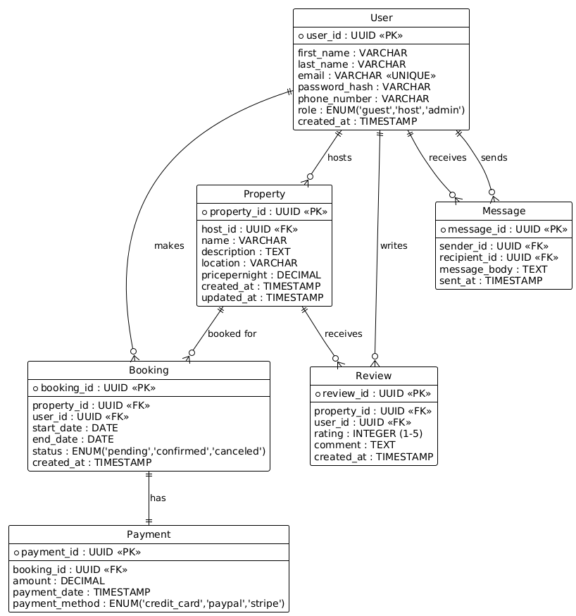

# Airbnb Database Normalization (Up to 3NF)

## Step 1: First Normal Form (1NF)
All tables have atomic columns (no repeating groups or lists).  
Each field stores a single value (e.g., one email per user, one property name per property).

**Result:** All tables satisfy 1NF.

---

## Step 2: Second Normal Form (2NF)
All tables use a single-column primary key (UUID).  
There are no partial dependencies because no table has a composite key.

**Result:** All tables satisfy 2NF.

---

## Step 3: Third Normal Form (3NF)
No non-key attribute depends on another non-key attribute.  

**Booking Table Adjustment:**  
- In the Booking table, `total_price` can be derived from `pricepernight * (end_date - start_date)`.  
  To maintain 3NF strictly, it can be removed or treated as a computed value.

**Fix:** Remove total_price from the Booking table. Compute it dynamically using:

```bash
SELECT 
    b.booking_id,
    p.pricepernight * DATEDIFF(b.end_date, b.start_date) AS total_price
FROM 
    Booking b
JOIN 
    Property p ON b.property_id = p.property_id;
```

**Result:** All tables are now fully in 3NF


# Updated Airbnb Database Schema ERD (3NF)

